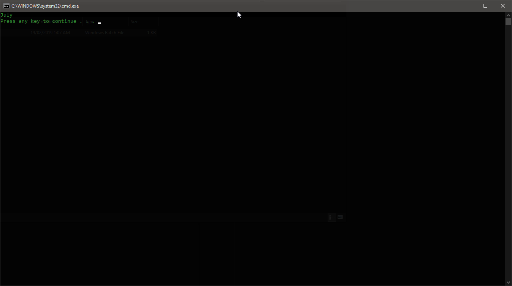
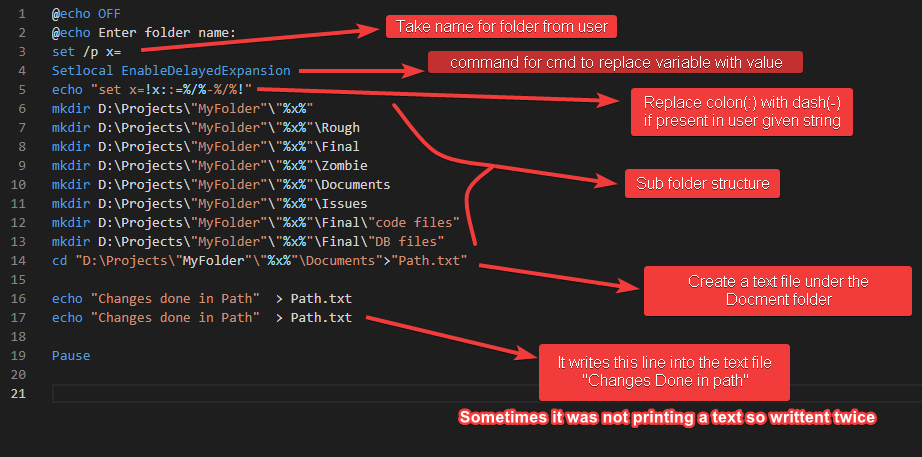

- [1. DatePrinter](#1-dateprinter)
- [2. CreateFolderStructure](#2-createfolderstructure)
- [3. Check Internet Connectivity (googlePing)](#3-check-internet-connectivity-googleping)

# 1. DatePrinter

- Prints a current running month
- It is a sample script you can use at different areas where you want to print current month.
- e.g. While renaming the file using batch file.

# 2. CreateFolderStructure

- This batch file is create a folder structure at particular location you want. it takes the Folder nae from user.

- If you have to change the location of path where you want to create a folder structure then you need to replace the path "D:\Projects" with your path, And ad the location where you want that folder structure need to be created.
- After running this batch file it will ask you for the folder name. (Add folder name without special characters)
- `Rough`, `Final`, `Zombie`, `Documents`, `Issues` Those are the sub folders which are getting created under your main folder.
- Path.txt changes causing some issue so it is still pending to add.

# 3. Check Internet Connectivity (googlePing)

- It will show you google connectivity

- If you have good connectivity then your output will be seen something like this.
- If you have bad connectivity you will see a `Request timed out` message intermediately or continuously. Or `time= ` section in report is also greater than 100ms then probably you have low speed internet connection.
